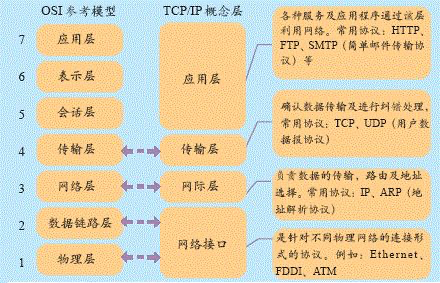
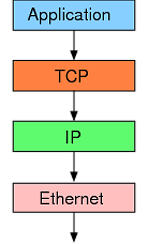
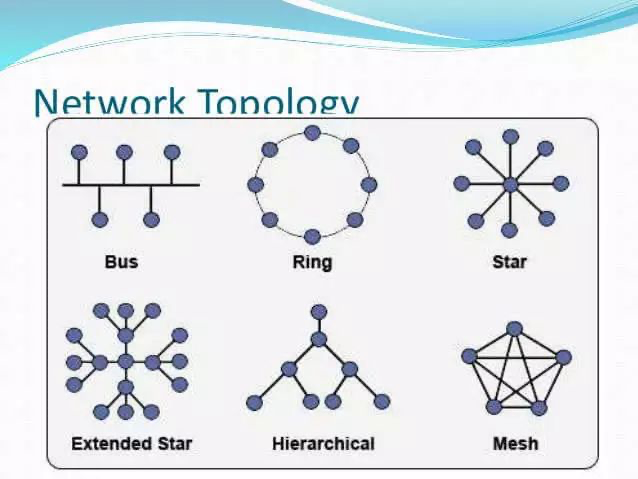

# 网络协议

概念图

互联网由一整套协议构成。TCP 只是其中的一层，有着自己的分工。

最底层的以太网协议（Ethernet）规定了电子信号如何组成数据包（packet），解决了子网内部的点对点通信。

但是，以太网协议不能解决多个局域网如何互通，这由 IP 协议解决。

IP 协议定义了一套自己的地址规则，称为 IP 地址。它实现了路由功能，允许某个局域网的 A 主机，向另一个局域网的 B 主机发送消息。

P 协议只是一个地址协议，并不保证数据包的完整。如果路由器丢包（比如缓存满了，新进来的数据包就会丢失），就需要发现丢了哪一个包，以及如何重新发送这个包。这就要依靠 TCP 协议。

简单说，TCP 协议的作用是，保证数据通信的完整性和可靠性，防止丢包

### 参考

1. [五分钟带你读懂TCP协议（图文并茂）](https://mp.weixin.qq.com/s/rg3eKuO07TG3j5oFvP915A)